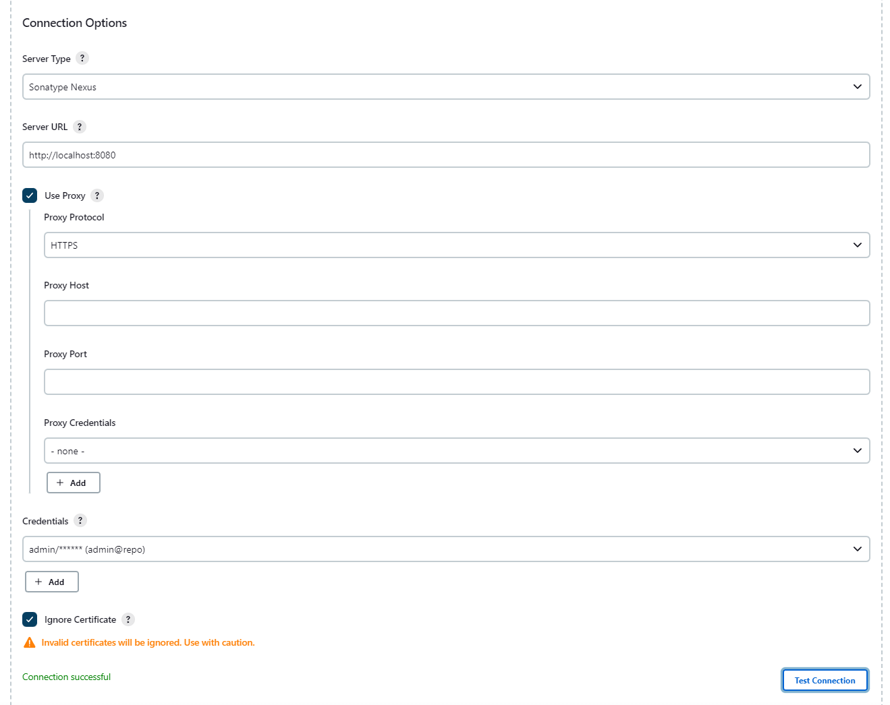
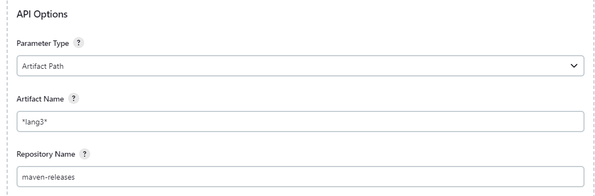
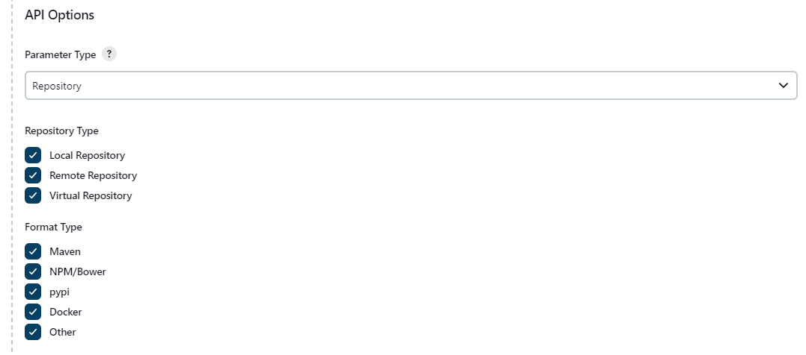
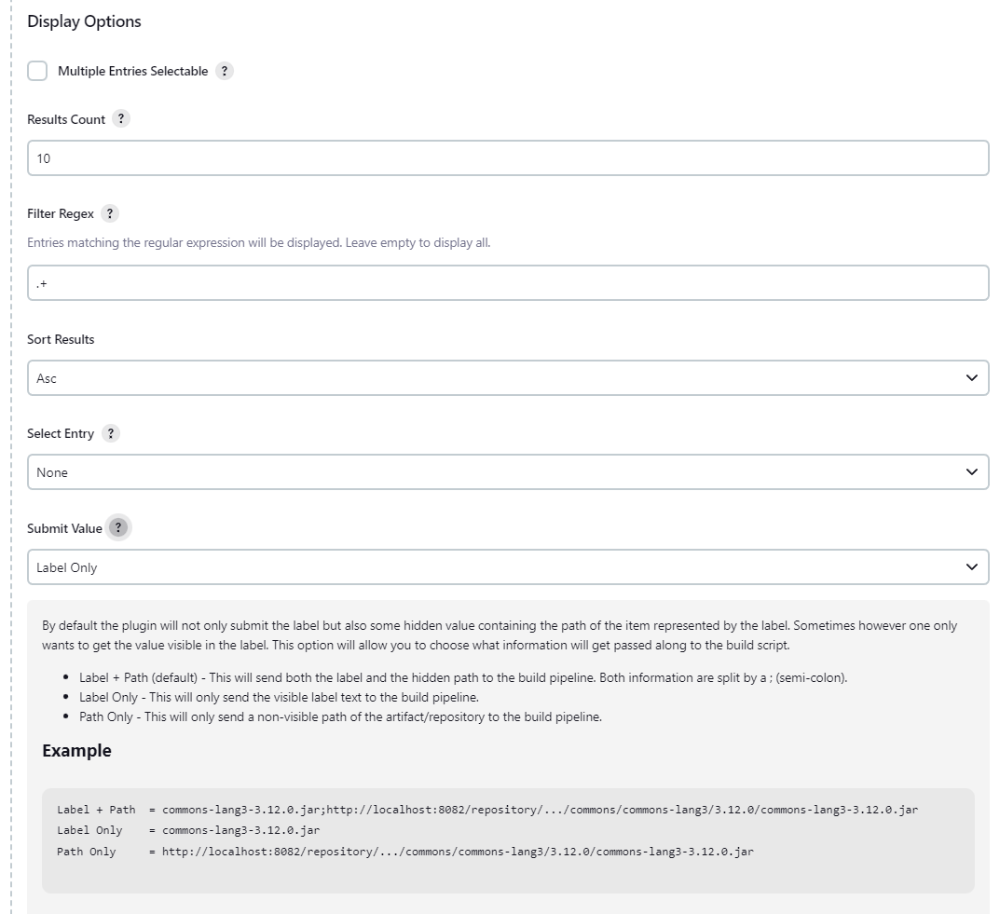
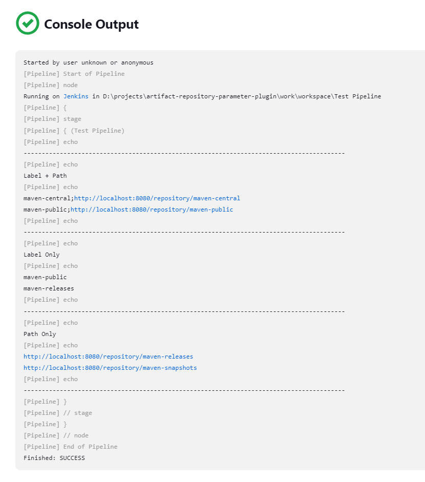

# Artifact Repository Parameter Plugin - Configuration

Following is an overview how to configure and use the plugin.

## Add Plugin To Build

As a first step the plugin must be added as a parameter to the build. This can easily be done
in the configuration view. Make sure the checkbox `This project is parameterized` is checked
and select the `Artifact Repository Parameter` entry.


The plugin comes with different options to configure.

## Connection Options

The next step is to configure the connection to the artifact repository. For this define the
type of the target repository along with the URL and access credentials. The plugin only supports
credentials of type `Username with password`. There is currently no support of access tokens
planned. Pull requests are welcome though. The connection to the server can then be verified
via the `Test Connection` button.

> The connection test is done against the repository endpoint by requesting all available
> repositories and then checking that at least one entry is returned. This check is
> independent of what is configured later on in the API options. It's just a check to see
> if a) the connection information is correct and b) the connection user has enough
> permissions to access at least one of the existing repositories.



The plugin supports the use of an HTTP proxy to access the repository server. There are two
locations where such an HTTP proxy can be configured.

1. In the build configuration make sure `Use Proxy` is checked and set the proxy information
   accordingly. When this option is set it takes precedence over the next option.
2. The other option is to set the proxy in the `Advanced` tab of the `plugin manager`.

> Please note that when no local proxy is set but a global one is the plugin  will always
> fall back to the global proxy.

The last option available is to ignore invalid certificates. This might be useful in local
environments with self-signed certs or for testing purposes. _Use with caution in production
and live environments!_

## API Options

This section lets one choose from different available endpoints. Depending on the endpoint
different configuration options are available.

> When requesting information from the target server the endpoints will always return results
> based on the permission of the user defined to open the connection to the server. Make sure
> this user has sufficient permissions to access the requested information.

### Artifact Path

When selecting the `Artifact Path` option the plugin will show the available artifacts along
with their path. To identify the artifact it is possible to define the artifact name and an
optional repository the artifact must exist in. An asterisk `*` can be used as a wildcard for the
artifact name. For more details please refer to the REST API of the respective repository.



> The option to use a simple wildcard may not always be sufficient. For a more powerful regex
> based filter option please check the `Display Options` section below.

> Artifactory allows to define multiple repositories while Nexus only allows to define a single
> repository. To harmonize the UI the plugin limits the possibility to specify a repository to one
> repository only.

### Artifact Version

The option `Artifact Version` allows to display the version of an artifact. Technically it is based
on the results of the previously mentioned path option and provides the possibility to define a
regex to extract the artifact's version from its path. This regex is using Java [Capturing Groups][link0]  
to identify the version based on the artifact's full path. An example regex to get the version of Maven-based
artifacts with a default version scheme (`Major.Minor.Path-Identifier.Extension`) is as follows:

```
.+/(\d+\.\d+(\.\d+((-CANDIDATE)?-SNAPSHOT)?)?)/.+
```


> Artifactory provides a dedicated endpoint for versions however this endpoint is only available in
> the commercial version. Both Artifactory OSS and Nexus OSS do not have a dedicated endpoint for the
> artifact's version. Hence, this approach was chosen to provide some generic way of retrieving a version.

### Repository

The last option available is `Repository` and provides the ability to display repositories and their
path on the target servers. To allow for more specific results one can define the repository and format
type. For the latter a generic option `Other` exists that matches anything not listed as a dedicated
option.



> Please note that this option shows a static list of repository format types that may not be available
> in either Artifactory OSS or Nexus OSS. In this case the selection will have no effect and be ignored.

## Display Options

This section allows to customize the look of the parameters in the  `Build with Parameters` view.



The checkbox `Multiple Entries Selectable` lets one choose whether one or multiple entries can be selected.

The `Results Count` allows to limit the number of results displayed in the UI.

The `Filter Regex` option is a possibility to filter the result list before displaying the entries
to the end user. This option was implemented due to the fact that the filter options available in
the REST APIs of the artifact repositories are quite basic and do not allow for more complex
filters. Any entry to be displayed must match the regex. If no regex is defined the option is ignored.

`Sort Results` simply sorts the results alphanumerical based on the selected order. It makes use of
the Alphanum sorting algorithm by Dave Koelle.

`Select Entry` allows to define whether an entry should get pre-selected when opening the
`Build with Parameters` view. It supports the option to pre-select either the first or the last entry
or any entry that matches a given regex.

The last option `Submit Value` allows to define what information will be sent to the build pipeline.
By default (option `Label + Path`), the plugin shows a human-readable label in the select box but sends
a different value to the pipeline. This value consists of the label but also contains the full path of
the artifact/repository identified by the visible label. With the option `Label Only` the same value
that is visible on the website gets send to the pipeline. With the option `Path Only` a non-visible
full path of the entry gets send to the pipeline.

## Build View

When starting a `Build with Parameters` one can see the available search results in a select box.
The available options are displayed in a short and easily readable way. Depending on the defined
`Submit Value` option however different information will get send to the pipeline.

The following example shows the parameter selection view and the corresponding pipeline script. Each
of the three select boxes has a different `Submit Value` option defined.


Based on the provided pipeline script following is the output of the pipeline script.




> When both label and path information are send to the pipeline both values will be seprated by
> a semicolon (`;`). When multiple entries are selected each entry is separated by a linebreak
> (`\n`).


[link0]: https://docs.oracle.com/javase/tutorial/essential/regex/groups.html
