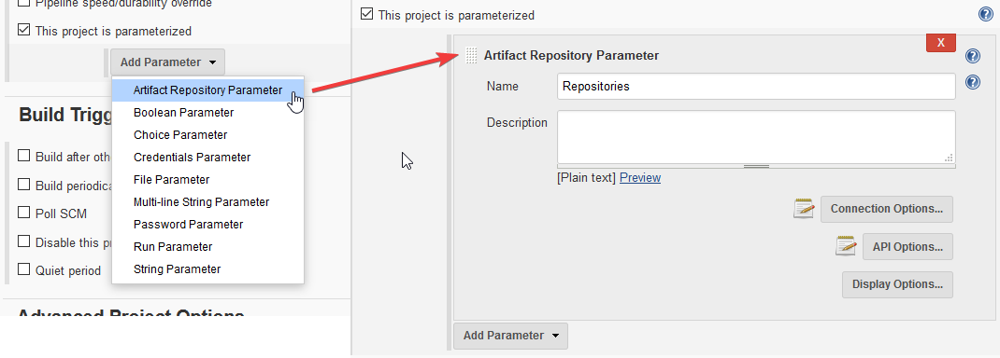
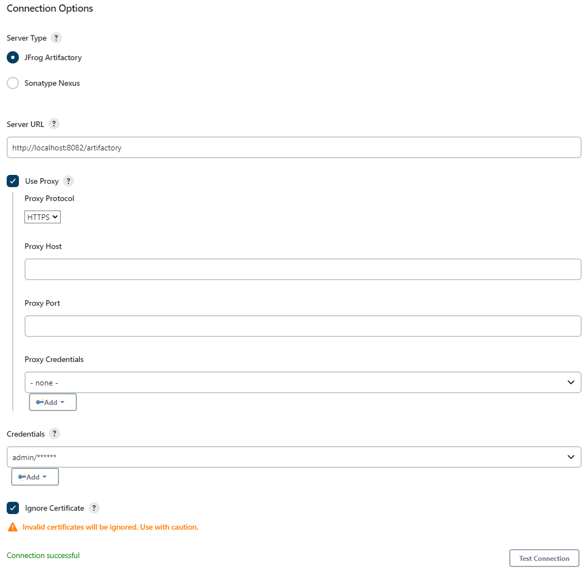
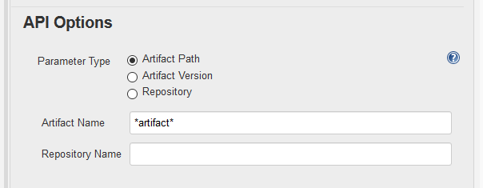
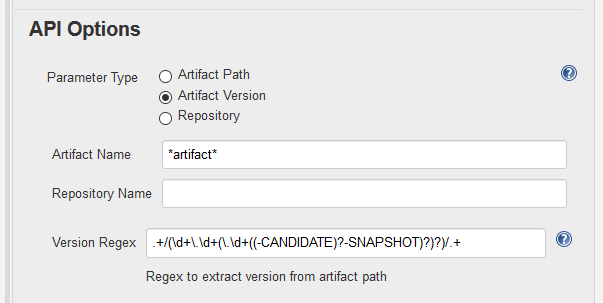
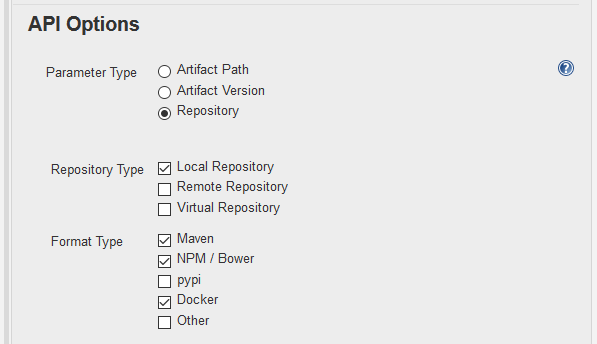
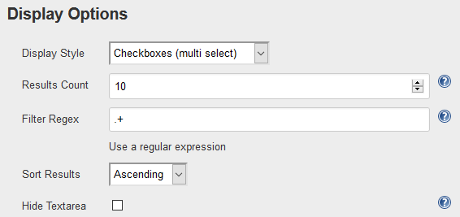
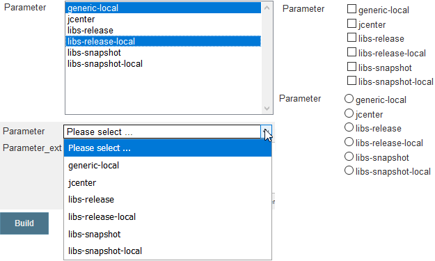
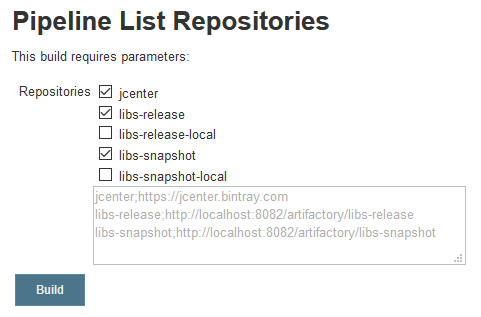

# Artifact Repository Parameter Plugin - Configuration

Following is an overview how to configure and use the plugin.

> For an example of a declarative pipeline that configures the plugin take a look at 
> `Jenkinsfile.declarative.sample`.

## Add plugin as build parameter

As a first step that plugin must be added as a parameter to the build. This can easily be done
in the configuration view. Make sure the checkbox `This project is parameterized` is checked
and select the `Artifact Repository Parameter` entry. 



## Connection Options

The next step is to configure the connection to the artifact repository. For this define the
type of the target repository along with the URL and access credentials. The plugin currently
only supports credentials of type `Username with password`. Currently no support of
access tokens is planned. Pull requests are welcome though. The connection to the server can
then be verified via the `Test Connection` button.

> The connection test is done against the repository endpoint by requesting all available
> repositories and then checking that at least one entry is returned. This check is
> independent from what is configured later on in the API options.


 
The plugin supports the use of an HTTP proxy to access the repository server. There are two
locations where such an HTTP proxy can be configured.

1. In the build configuration make sure `Use Proxy` is checked and set the proxy information
   accordingly. When this option is set it takes precedence over the next option.
2. The other option is to set the proxy in the `Advanced` tab of the `plugin manager`.

> Please note that when no local proxy is set but a global one is the plugin  will always 
> fall back to the global proxy. There is currently no option to ignore the global proxy 
> if set. Also there is currently no support for ignore hosts in the context of the proxy
> setting. Pull requests are welcome though.

The last option available is to ignore invalid certificates. This might be useful in local 
environments with self-signed certs or for testing purposes. Use with caution in production
and live environments.

## API Options

This section lets one choose from different available endpoints. Depending on the endpoint 
different options are available.

> When requesting information from the target server the endpoints will always return results
> based on the permission of the user defined in the connection section. Make sure the technical
> user has sufficient permissions to access the requested information.

### Path

When selecting the `Artifact Path` option the plugin will show the available artifacts along
with their path. To identify the artifact it is possible to define the artifact name and an
optional repository the artifact must exist in. An asterisk `*` can be used as a wildcard for the
artifact name. For more details please refer to the REST API of the respective repository.



> Artifactory allows to define multiple repositories while Nexus only allows to define a single
> repository. To harmonize the UI the plugin limits the possibility to specify a repository to one.

### Version

The option `Artifact Version` allows to display the version of an artifact. Technically it is based
on the path option but provides the possibility to define a `Version Regex` used to extract the
artifact's version from its path. This regex is using [Capturing Groups][link0]  to identify the 
version based on the artifact's full path. An example regex to get the version of Maven-based 
artifacts is as follows:

```
.+/(\d+\.\d+(\.\d+(-SNAPSHOT)?)?)/.+
```

> Artifactory provides a dedicated endpoint for versions however this endpoint is only available in
> the commercial version. Both Artifactory OSS and Nexus OSS do not have an endpoint for the artifact's
> version. Hence this approach was chosen to provide some basic way of retrieving a version.



### Repository

The last option available is `Repository` and provides the ability to display repositories available
on the target servers. To allow for more specific results one can define the repository and format
type. For the latter a generic option `Other` exists that matches anything not listed as a dedicated
option.



> Please note that this option shows a static list of repository format types that may not be available
> in Artifactory OSS. In this case the selection will have no effect and be ignored.

## Display Options

This section allows to customize the look of the parameters in the  `Build with Parameters` view.



`Display Style` allows to customize how entries are displayed. Following is a screenshot of all 
possible representations of the same plugin.



The `Results Count` allows to limit the number of results displayed in the UI.

The `Filter Regex` is another possibility to filter the result list before displaying the entries
to the end user. This option was implemented due to the fact that the filter options available in 
the REST APIs of the artifact repositories are quite basic and do not allow for more complex 
filters. Any entry to be displayed must match the regex. Hence a default value `.+` is used to
display all entries out of the box. If the configuration field is left empty an implicit `.+` is used.

`Sort Results` simply sorts the results alphabetically based on the selected order.

`Hide Textarea` allows to hide the textarea displayed below the selection options. Check the explanation
in the build view section below for more information about this feature.

`Select Entry` allows to define whether or not an entry should get pre-selected when opening the
`Build with Parameters` view. Currently the selection of the first and the last entry are supported.

## Build View

When starting a build with parameters one can see the available options and a textarea below (if not
hidden in the config). The available options are displayed in a short and easily readable way but
sometimes the full information (_e. g. for a repository the full path and not just the repository
name_) is required. For this use case the plugin writes whatever was selected to the textarea with
both the visible label and a corresponding extended value. Both values are seperated by a
semicolon `;`. When multiple options are selected those will be seperated by a linebreak `\n`.
The content of this textarea is the actual parameter value that is made available to the
pipline script. It is then up to the pipeline creator to process the information accordingly and
decide what information is required for the task. 

> Since this may contain information that one does not want to make visible to whoever is starting 
> a build it is possible to hide the textarea (see display options above).



> For some reason I couldn't get it to work with the key/value attributes of the checkbox/radio 
> button. It then only returns true/false depending on the selection and not the values. If someone
> knows for a way to get this working please feel free to share this information with us. Until 
> then this "dirty" hack with the textbox was chosen.


[link0]: https://docs.oracle.com/javase/tutorial/essential/regex/groups.html
